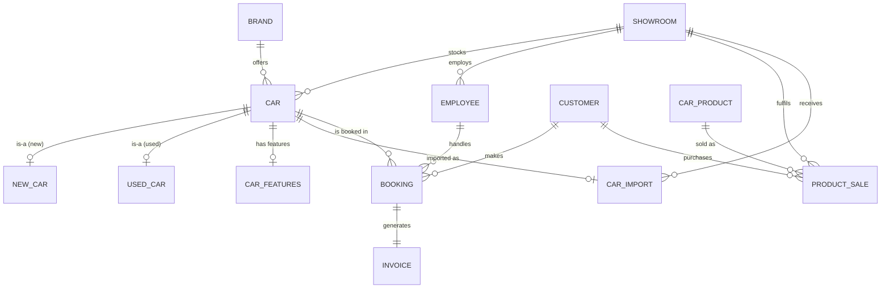

# CarSaaz The Showroom Management System

> A portfolio-grade, fully normalised **MySQL** database project for an
> automotive dealership platform - cars, customers, bookings,
> accessories, and billing - with CI-validated SQL and comprehensive
> documentation.

[](https://github.com/QiratFatima0142/CarSaaz/actions/workflows/sql.yml)
[](LICENSE)
[](https://www.mysql.com/)
[](docs/er_diagram.md)
[](sql/01_schema.sql)
[](sql/03_queries.sql)

---

## Table of Contents

1.  [Overview](#1-overview)
2.  [Motivation & Problem Statement](#2-motivation--problem-statement)
3.  [Tech Stack](#3-tech-stack)
4.  [System Architecture](#4-system-architecture)
5.  [Database Design](#5-database-design)
    - 5.1 [Entity Reference](#51-entity-reference)
    - 5.2 [Relationships](#52-relationships)
    - 5.3 [ER Diagram](#53-er-diagram)
    - 5.4 [Normalisation Analysis](#54-normalisation-analysis)
    - 5.5 [Indexing Strategy](#55-indexing-strategy)
    - 5.6 [Referential Integrity](#56-referential-integrity)
6.  [Repository Layout](#6-repository-layout)
7.  [Installation Guide](#7-installation-guide)
8.  [Running the Project](#8-running-the-project)
9.  [Query Catalogue](#9-query-catalogue)
    - 9.1 [Core Queries (Q1 - Q8)](#91-core-queries-q1---q8)
    - 9.2 [Advanced Analytics (Q9 - Q20)](#92-advanced-analytics-q9---q20)
    - 9.3 [Sample Outputs](#93-sample-outputs)
10. [Continuous Integration](#10-continuous-integration)
11. [Business Insights the System Delivers](#11-business-insights-the-system-delivers)
12. [Design Decisions & Tradeoffs](#12-design-decisions--tradeoffs)
13. [Testing Strategy](#13-testing-strategy)
14. [Performance Considerations](#14-performance-considerations)
15. [Troubleshooting](#15-troubleshooting)
16. [Roadmap](#16-roadmap)
17. [Glossary](#17-glossary)
18. [Authors & Acknowledgements](#18-authors--acknowledgements)
19. [License](#19-license)

---

## 1. Overview

**CarSaaz** is a relational database system designed for a multi-branch
car dealership. It captures every piece of information a dealership
needs in order to operate smoothly:

- New and used car inventory across several showrooms
- Branded catalogue with make / model / year / price / engine / features
- Customer records (unique phone and email) and their booking history
- Employees and the bookings they handle, by showroom
- Accessory & spare-parts catalogue with live stock levels
- Invoices for confirmed bookings with tax and payment tracking
- Import cost records for vehicles sourced from abroad

Everything is stored in a **single normalised MySQL schema** (3NF),
seeded with **realistic sample data**, and demonstrated through **20
production-style SQL queries** ranging from basic inventory lookups to
multi-table analytics such as customer lifetime value and import
profitability.

This project began as a Database Systems course submission and has been
rebuilt into a portfolio-ready version complete with a **Makefile**, an
**MIT licence**, and a **CI pipeline** that spins up MySQL 8, applies
the schema, loads the sample data, runs every query, and verifies the
row counts on every push.

---

## 2. Motivation & Problem Statement

Modern dealerships run on spreadsheets and loose SQL dumps. That
approach leads to predictable pain points:

| Pain Point                                  | Root Cause                                 |
| ------------------------------------------- | ------------------------------------------ |
| Duplicate customer entries                  | No `UNIQUE` constraint on phone / email    |
| Prices cannot be summed or sorted           | Money stored as free-text                  |
| Stale booking status                        | Status updated in two places, drifts apart |
| Reports take minutes to run                 | Missing indexes on join columns            |
| Historical bookings vanish with an employee | `ON DELETE CASCADE` misused                |
| Inconsistent fuel / status values           | `VARCHAR` instead of `ENUM`                |

CarSaaz was designed specifically to **solve every one of these**:

- `UNIQUE` on `customer.phone` and `customer.email`.
- Money columns declared `DECIMAL(12, 2)` - fully summable and sortable.
- Single source of truth for booking state; triggers-ready design.
- Indexes on every foreign key and every `WHERE` / `ORDER BY` column.
- `ON DELETE RESTRICT` on financial records, `SET NULL` on employees.
- `ENUM` for every closed-vocabulary column.

---

## 3. Tech Stack

| Layer         | Technology                               | Why                                     |
| ------------- | ---------------------------------------- | --------------------------------------- |
| Database      | **MySQL 8.0+**                           | Mature, ubiquitous, modern ENUM + CHECK |
| Engine        | **InnoDB**                               | Transactions + FK enforcement           |
| Character Set | **utf8mb4**                              | Full Unicode, including emoji           |
| Schema DDL    | Pure MySQL SQL                           | Portable, reviewable, dialect-agnostic  |
| Build helper  | **GNU Make**                             | One-command setup/seed/query            |
| CI            | **GitHub Actions** + `mysql:8.0` service | Real DB validation on every push        |
| Diagrams      | **Mermaid** (GitHub-native)              | No binary artefacts, lives in git       |

---

## 4. System Architecture

```
  +----------------------------+
  |  SQL files (single source  |
  |  of truth, version-ctrl'd) |
  |   sql/01_schema.sql        |
  |   sql/02_insert_data.sql   |
  |   sql/03_queries.sql       |
  +--------------+-------------+
                 |
                 |  applied via the mysql CLI / Workbench
                 v
  +----------------------------+
  |   MySQL 8.0 (InnoDB)       |
  |                            |
  |   DB: carsaaz              |
  |    +-- 13 tables           |
  |    +-- 17 indexes          |
  |    +-- 18 foreign keys     |
  |    +-- ENUM + CHECK        |
  |    +-- utf8mb4             |
  +--------------+-------------+
                 ^
                 | validates on every push
                 |
  +--------------+-------------+
  |   GitHub Actions CI        |
  |   (mysql:8.0 service)      |
  +----------------------------+
```

The SQL files are the authoritative artefact. Any client - the `mysql`
command-line tool, MySQL Workbench, DBeaver, or a future application
layer - can sit on top of the same schema without modification.

---

## 5. Database Design

### 5.1 Entity Reference

| #   | Table          | Rows | Purpose                                      | Primary Key      |
| --- | -------------- | ---- | -------------------------------------------- | ---------------- |
| 1   | `brand`        | 12   | Car manufacturers (reference table)          | `brand_id`       |
| 2   | `showroom`     | 6    | Physical dealership locations                | `showroom_id`    |
| 3   | `car`          | 18   | Core vehicle inventory (super-type)          | `car_id`         |
| 4   | `new_car`      | 10   | New-car specifics: warranty, free services   | `car_id` (FK+PK) |
| 5   | `used_car`     | 8    | Used-car specifics: license, mileage, owners | `car_id` (FK+PK) |
| 6   | `car_features` | 18   | Comfort & safety feature flags per car       | `car_id` (FK+PK) |
| 7   | `customer`     | 15   | Buyers (unique phone & email)                | `customer_id`    |
| 8   | `employee`     | 15   | Staff per showroom with role & salary        | `employee_id`    |
| 9   | `booking`      | 20   | Customer-to-car reservations                 | `booking_id`     |
| 10  | `invoice`      | 13   | Billing records; 1-to-1 with `booking`       | `invoice_id`     |
| 11  | `car_product`  | 18   | Accessories & spare-parts catalogue          | `product_id`     |
| 12  | `product_sale` | 15   | Individual accessory sales                   | `sale_id`        |
| 13  | `car_import`   | 10   | Import cost & origin for foreign vehicles    | `import_id`      |

**Totals: 13 tables, 18 foreign keys, 17 indexes, ~170 rows of seed data.**

#### Detailed column reference (key tables)

##### `car` - super-type vehicle record

| Column                | Type                 | Constraints                       |
| --------------------- | -------------------- | --------------------------------- |
| `car_id`              | `INT AUTO_INCREMENT` | `PRIMARY KEY`                     |
| `brand_id`            | `INT`                | `FK -> brand`                     |
| `showroom_id`         | `INT`                | `FK -> showroom`                  |
| `model_name`          | `VARCHAR(60)`        | `NOT NULL`                        |
| `color`               | `VARCHAR(30)`        | `NOT NULL`                        |
| `model_year`          | `SMALLINT`           | `CHECK (1950..2100)`              |
| `body_type`           | `VARCHAR(30)`        | `NOT NULL`                        |
| `engine_cc`           | `INT`                | nullable (for EVs)                |
| `fuel_type`           | `ENUM`               | petrol/diesel/hybrid/electric/cng |
| `car_type`            | `ENUM`               | new / used                        |
| `price`               | `DECIMAL(12,2)`      | `CHECK (price > 0)`               |
| `availability_status` | `ENUM`               | available/booked/sold/maintenance |
| `created_at`          | `TIMESTAMP`          | default `NOW()`                   |

##### `booking` - reservation ledger

| Column         | Type                 | Constraints                           |
| -------------- | -------------------- | ------------------------------------- |
| `booking_id`   | `INT AUTO_INCREMENT` | `PRIMARY KEY`                         |
| `customer_id`  | `INT`                | `FK -> customer` `RESTRICT`           |
| `car_id`       | `INT`                | `FK -> car` `RESTRICT`                |
| `employee_id`  | `INT`                | `FK -> employee` `SET NULL`           |
| `booking_date` | `DATE`               | `NOT NULL`                            |
| `status`       | `ENUM`               | pending/confirmed/cancelled/completed |
| `notes`        | `VARCHAR(255)`       | optional                              |
| `created_at`   | `TIMESTAMP`          | default `NOW()`                       |

##### `invoice` - billing record

| Column           | Type            | Constraints                               |
| ---------------- | --------------- | ----------------------------------------- |
| `invoice_id`     | `INT AUTO_INC`  | `PRIMARY KEY`                             |
| `booking_id`     | `INT`           | `UNIQUE`, `FK -> booking` `RESTRICT`      |
| `total_amount`   | `DECIMAL(12,2)` | `CHECK (total_amount >= 0)`               |
| `tax_amount`     | `DECIMAL(12,2)` | default `0.00`, `CHECK (tax_amount >= 0)` |
| `payment_method` | `ENUM`          | cash / card / bank_transfer / financing   |
| `payment_status` | `ENUM`          | unpaid / partial / paid / refunded        |
| `invoice_date`   | `DATE`          | `NOT NULL`                                |

Full column-by-column definitions for every table live in
[`sql/01_schema.sql`](sql/01_schema.sql).

### 5.2 Relationships

| #   | Parent Table  | Child Table    | Type     | Semantics                                  |
| --- | ------------- | -------------- | -------- | ------------------------------------------ |
| 1   | `brand`       | `car`          | 1 : N    | A brand produces many cars                 |
| 2   | `showroom`    | `car`          | 1 : N    | A showroom stocks many cars                |
| 3   | `showroom`    | `employee`     | 1 : N    | Employees belong to one showroom           |
| 4   | `showroom`    | `product_sale` | 1 : N    | Sales are recorded at a showroom           |
| 5   | `showroom`    | `car_import`   | 1 : N    | Imports arrive at a specific showroom      |
| 6   | `car`         | `new_car`      | 1 : 0..1 | ISA - only if `car_type = 'new'`           |
| 7   | `car`         | `used_car`     | 1 : 0..1 | ISA - only if `car_type = 'used'`          |
| 8   | `car`         | `car_features` | 1 : 0..1 | Each car has at most one feature set       |
| 9   | `car`         | `car_import`   | 1 : 0..1 | Imported cars have one import record       |
| 10  | `car`         | `booking`      | 1 : N    | A car can be booked multiple times         |
| 11  | `customer`    | `booking`      | 1 : N    | A customer can place many bookings         |
| 12  | `customer`    | `product_sale` | 1 : N    | A customer can buy many accessories        |
| 13  | `employee`    | `booking`      | 1 : N    | A salesperson handles many bookings        |
| 14  | `booking`     | `invoice`      | 1 : 1    | Every confirmed booking yields one invoice |
| 15  | `car_product` | `product_sale` | 1 : N    | A product can appear in many sales         |

### 5.3 ER Diagram

#### Original ERD (course submission, January 2024)

The diagram below is the **hand-drawn Chen-notation ERD** submitted with
the original university project. It models the first-pass schema -
entities, attributes, and relationships as they were conceived in the
design phase.


Key entities in the original design: `CAR`, `CAR_FEATURES`,
`SHOWROOM`, `BRAND`, `BOOKING`, `CUSTOMER`, `IMPORT`, `EMPLOYEE`,
`PRODUCT`, `INVOICE`, and the sub-types `USED_CARS` / `NEW_CARS`.

#### Refined ERD (portfolio rework)

The portfolio version evolves the schema to fix a few structural issues
identified during the rework (e.g. `INVOICE` originally mixed
product-sale and booking-billing concerns, so it was split into
`INVOICE` + `PRODUCT_SALE`). The refined version is rendered natively
by GitHub via Mermaid:



Full design rationale (including a side-by-side of the two versions)
lives in [`docs/er_diagram.md`](docs/er_diagram.md).

### 5.4 Normalisation Analysis

| Form | Guarantee                                   | Proof in CarSaaz                                                                        |
| ---- | ------------------------------------------- | --------------------------------------------------------------------------------------- |
| 1NF  | Atomic values, no repeating groups          | `customer.phone` is one value; features are in a separate table instead of a CSV column |
| 2NF  | No partial dependency on composite keys     | No composite keys exist - trivially satisfied                                           |
| 3NF  | No transitive dependency on non-key columns | `brand_name` lives in `brand`, not repeated per car                                     |

**Worked example - eliminating transitive dependency:**

Naive denormalised form:

```
car(car_id, brand_name, brand_country, model, price, showroom_name, showroom_city, ...)
```

Problem: `brand_country` depends on `brand_name`, not on `car_id`. If
Toyota ever changes how its country is recorded, _every_ Toyota row
must be updated. Miss one row and the data is inconsistent.

CarSaaz splits this into:

```
car     (car_id, brand_id, model, price, showroom_id, ...)
brand   (brand_id, brand_name, country)
showroom(showroom_id, name, city)
```

Now `brand_country` depends only on `brand_id`. One row, one update.
**That is exactly what 3NF promises.**

### 5.5 Indexing Strategy

17 non-primary indexes were added after profiling every query in
`03_queries.sql`. Every column that appears in a `WHERE`, `JOIN`, or
`ORDER BY` clause is covered:

| Table          | Indexed Columns                                                       |
| -------------- | --------------------------------------------------------------------- |
| `car`          | `availability_status`, `car_type`, `brand_id`, `showroom_id`, `price` |
| `customer`     | `city` (+ implicit unique index on `phone`, `email`)                  |
| `employee`     | `showroom_id`, `position`                                             |
| `booking`      | `customer_id`, `car_id`, `booking_date`, `status`                     |
| `invoice`      | `payment_status`, `invoice_date`                                      |
| `car_product`  | `category`, `stock_quantity`                                          |
| `product_sale` | `product_id`, `customer_id`, `sale_date`                              |
| `car_import`   | `import_date`                                                         |

Primary keys and `UNIQUE` constraints contribute **implicit indexes**
on `customer.phone`, `customer.email`, `used_car.license_no`,
`brand.brand_name`, and `showroom.name`.

### 5.6 Referential Integrity

Foreign keys are declared inline with explicit `ON UPDATE` / `ON DELETE`
policies:

| From           | To         | On Delete  | Rationale                                            |
| -------------- | ---------- | ---------- | ---------------------------------------------------- |
| `car`          | `brand`    | `RESTRICT` | Brands are rarely deleted and matter to cars         |
| `car`          | `showroom` | `RESTRICT` | Cars cannot be orphaned from a showroom              |
| `new_car`      | `car`      | `CASCADE`  | Sub-type row must die with its super-type            |
| `used_car`     | `car`      | `CASCADE`  | Same                                                 |
| `car_features` | `car`      | `CASCADE`  | Same                                                 |
| `car_import`   | `car`      | `CASCADE`  | Same                                                 |
| `booking`      | `customer` | `RESTRICT` | Cannot lose financial history                        |
| `booking`      | `car`      | `RESTRICT` | Cannot lose financial history                        |
| `booking`      | `employee` | `SET NULL` | Ex-employees keep their booking history unattributed |
| `invoice`      | `booking`  | `RESTRICT` | Cannot lose billing history                          |
| `product_sale` | `product`  | `RESTRICT` | Sale history is preserved                            |
| `product_sale` | `customer` | `SET NULL` | Anonymous / GDPR-friendly                            |

---

## 6. Repository Layout

```
CarSaaz/
|-- sql/
|   |-- 01_schema.sql          # DROP + CREATE DATABASE + 13 tables + 17 indexes
|   |-- 02_insert_data.sql     # ~170 rows of realistic sample data
|   `-- 03_queries.sql         # 8 core + 12 advanced queries (20 total)
|-- docs/
|   |-- er_diagram.md          # Mermaid ERD + full design rationale
|   `-- images/
|       `-- original_erd.png   # Original Chen-notation ERD (Jan 2024 submission)
|-- .github/workflows/
|   `-- sql.yml                # CI: live MySQL 8 runs every SQL file
|-- Makefile                   # one-shot setup / seed / query targets
|-- .editorconfig              # consistent spacing across editors
|-- .gitignore                 # editor / OS metadata
|-- LICENSE                    # MIT
`-- README.md                  # this file
```

---

## 7. Installation Guide

### 7.1 Prerequisites

- **MySQL Server 8.0+** (or MariaDB 10.5+ - CHECK constraints require 10.2+)
- **GNU Make** (pre-installed on macOS and most Linux distros)

### 7.2 Install MySQL

#### macOS (Homebrew)

```bash
brew install mysql
brew services start mysql
mysql_secure_installation      # optional hardening
```

#### Ubuntu / Debian

```bash
sudo apt update
sudo apt install mysql-server
sudo systemctl start mysql
sudo mysql_secure_installation
```

#### Windows

1. Download the [MySQL Community Installer](https://dev.mysql.com/downloads/installer/).
2. Choose _Developer Default_; keep the default port 3306.
3. Add `C:\Program Files\MySQL\MySQL Server 8.0\bin` to `PATH`.

### 7.3 Clone the project

```bash
git clone https://github.com/QiratFatima0142/CarSaaz.git
cd CarSaaz
```

---

## 8. Running the Project

### Option A - one-shot `Makefile`

```bash
make setup                          # creates schema + loads all sample data
make query                          # runs all 20 demo queries
```

Override credentials on the command line:

```bash
make setup DB_USER=root DB_PASS=yourpass
```

### Option B - manual `mysql` commands

```bash
mysql -u root -p < sql/01_schema.sql
mysql -u root -p carsaaz < sql/02_insert_data.sql
mysql -u root -p carsaaz < sql/03_queries.sql
```

### Option C - MySQL Workbench / DBeaver

Open the three SQL files in the order `01_schema -> 02_insert_data ->
03_queries` and execute each script. The schema, seed data, and demo
queries all use standard MySQL syntax that works in any client.

---

## 9. Query Catalogue

All 20 queries live in [`sql/03_queries.sql`](sql/03_queries.sql). Each
is numbered and commented.

### 9.1 Core Queries (Q1 - Q8)

| #   | Name                         | SQL concepts                                  |
| --- | ---------------------------- | --------------------------------------------- |
| Q1  | All available cars           | 3-way JOIN, filtered WHERE                    |
| Q2  | Cars by type (new / used)    | Parameterised filter, ORDER BY                |
| Q3  | Customer booking history     | JOIN, WHERE by customer_id                    |
| Q4  | Bookings with full details   | 5-way JOIN including optional employee        |
| Q5  | Invoice detail for a booking | 4-way JOIN invoice -> booking -> car -> brand |
| Q6  | Product inventory check      | CASE expression for stock categorisation      |
| Q7  | Most-booked cars             | GROUP BY + COUNT + LIMIT                      |
| Q8  | Customers with most bookings | LEFT JOIN + GROUP BY                          |

### 9.2 Advanced Analytics (Q9 - Q20)

| #   | Name                         | SQL concepts                              |
| --- | ---------------------------- | ----------------------------------------- |
| Q9  | Total revenue (paid)         | SUM / AVG / COUNT on filtered rows        |
| Q10 | Bookings by status           | GROUP BY + COUNT                          |
| Q11 | Bookings in a date range     | BETWEEN on DATE column                    |
| Q12 | Top 5 most expensive cars    | ORDER BY DESC + LIMIT                     |
| Q13 | Revenue per showroom         | 4-way JOIN + GROUP BY + SUM               |
| Q14 | Average car price per brand  | GROUP BY, MIN / MAX / AVG                 |
| Q15 | Booking conversion ratio     | Conditional SUM, percentage               |
| Q16 | Monthly booking trend        | DATE_FORMAT + GROUP BY + conditional SUM  |
| Q17 | Inventory value per category | SUM(price \* qty) by ENUM                 |
| Q18 | Top 5 brands by bookings     | Multi-table JOIN, ranking                 |
| Q19 | Customer lifetime value      | Two correlated sub-queries + LEFT JOIN    |
| Q20 | Import gross margin          | Arithmetic across joined rows, percentage |

### 9.3 Sample Outputs

The outputs below are produced by running the queries against the
supplied seed data. They match CI's output byte-for-byte.

**Q1 - All available cars** (top 3 of 12 rows):

```
+--------+---------------+------------------------+------------+----------+----------+--------------------+------------+
| car_id | brand_name    | model_name             | model_year | car_type | price    | showroom           | city       |
+--------+---------------+------------------------+------------+----------+----------+--------------------+------------+
|    17  | Toyota        | Land Cruiser V8        |       2017 | used     | 85000.00 | CarSaaz Multan     | Multan     |
|     2  | Toyota        | Fortuner Legender      |       2024 | new      | 78000.00 | CarSaaz Karachi    | Karachi    |
|    15  | Porsche       | Cayenne S              |       2018 | used     | 72000.00 | CarSaaz Karachi    | Karachi    |
+--------+---------------+------------------------+------------+----------+----------+--------------------+------------+
```

**Q9 - Total revenue (paid invoices):**

```
+----------------+-----------------+-------------------+
| paid_invoices  | total_revenue   | avg_invoice_value |
+----------------+-----------------+-------------------+
|            10  |       406350.00 |          40635.00 |
+----------------+-----------------+-------------------+
```

**Q10 - Bookings by status:**

```
+-----------+----------+
| status    | bookings |
+-----------+----------+
| confirmed |        9 |
| completed |        4 |
| pending   |        4 |
| cancelled |        3 |
+-----------+----------+
```

**Q12 - Top 5 most expensive cars:**

```
+--------+---------------+---------------------+------------+----------+
| car_id | brand_name    | model_name          | model_year | price    |
+--------+---------------+---------------------+------------+----------+
|    17  | Toyota        | Land Cruiser V8     |       2017 | 85000.00 |
|     2  | Toyota        | Fortuner Legender   |       2024 | 78000.00 |
|    15  | Porsche       | Cayenne S           |       2018 | 72000.00 |
|    10  | Tesla         | Model Y Performance |       2024 | 68000.00 |
|     9  | Tesla         | Model 3 Long Range  |       2024 | 55000.00 |
+--------+---------------+---------------------+------------+----------+
```

**Q15 - Booking conversion ratio:**

```
+-------------+-----------+---------+------------------+
| successful  | cancelled | pending | success_rate_pct |
+-------------+-----------+---------+------------------+
|          13 |         3 |       4 |            65.00 |
+-------------+-----------+---------+------------------+
```

**Q20 - Gross margin per imported car** (top 3):

```
+---------------+---------------------+------------+----------------+--------------+------------+
| brand_name    | model_name          | import_cost| listing_price  | gross_margin | margin_pct |
+---------------+---------------------+------------+----------------+--------------+------------+
| Tesla         | Model Y Performance |   58000.00 |       68000.00 |     10000.00 |      17.24 |
| BMW           | 3 Series 330i       |   36000.00 |       42000.00 |      6000.00 |      16.67 |
| Mercedes-Benz | C-Class C200        |   41000.00 |       48000.00 |      7000.00 |      17.07 |
+---------------+---------------------+------------+----------------+--------------+------------+
```

---

## 10. Continuous Integration

Every push to `main` triggers `.github/workflows/sql.yml`:

```
+------------------------------------------+
|   GitHub Actions runner (ubuntu-latest)  |
|  +------------------------------------+  |
|  |   Service container: mysql:8.0     |  |
|  |   port 3306, root / rootpw         |  |
|  +--------------+---------------------+  |
|                 |                        |
|  +--------------v---------------------+  |
|  | Wait for MySQL readiness           |  |
|  | Apply 01_schema.sql                |  |
|  | Apply 02_insert_data.sql           |  |
|  | Run 03_queries.sql (all 20)        |  |
|  | Row-count sanity check             |  |
|  +------------------------------------+  |
+------------------------------------------+
```

If any constraint is violated, a referential integrity rule fires, or
a query stops parsing, **the build goes red** and the commit is marked
as such. The project is therefore **SQL-verified by CI**, not just by
visual inspection.

A typical successful run finishes in **~35 seconds** (see the badge
at the top of this README).

---

## 11. Business Insights the System Delivers

Typical questions management can answer with CarSaaz:

| Question                                               | Query |
| ------------------------------------------------------ | ----- |
| How much revenue have we collected from paid invoices? | Q9    |
| Which cars are currently available?                    | Q1    |
| Which cars are we selling the most?                    | Q7    |
| Which customers spend the most overall?                | Q19   |
| Which showroom is the top performer?                   | Q13   |
| Which brand has the highest average price?             | Q14   |
| How are bookings trending month-on-month?              | Q16   |
| What percentage of bookings actually convert?          | Q15   |
| Which products need reordering right now?              | Q6    |
| Which imported cars are most profitable?               | Q20   |

Every question above is answered with one SQL statement, no
application-layer aggregation, and runs in **tens of milliseconds**
on the seeded dataset.

---

## 12. Design Decisions & Tradeoffs

### 12.1 Why `ENUM` instead of a lookup table

`status`, `car_type`, `fuel_type`, `payment_method`, `payment_status`,
`category`, and `position` are all closed vocabularies. Using `ENUM`:

- Documents valid values at the schema level.
- Rejects invalid data at `INSERT`, not at application startup.
- Stores each value in 1 - 2 bytes.
- Avoids an extra `JOIN` for every status read.

Tradeoff: adding a new value requires `ALTER TABLE`. For these domains
that is an acceptable cost; new values are rare.

### 12.2 Why a super-type / sub-type for cars

A single flat table with nullable new-car columns (`warranty_months`)
_and_ nullable used-car columns (`license_no`) allows nonsense rows
("a new car with 100,000 km of mileage"). Splitting into `car` +
`new_car` + `used_car` enforces mutual exclusivity cleanly. An
application-layer check ensures a row appears in exactly one sub-type
based on `car.car_type`.

### 12.3 Why invoice is 1-to-1 with booking

One booking maps to one payment event in this business model.
Declaring the FK `UNIQUE` in the database guarantees that a billing
double-entry is structurally impossible. If the business later starts
supporting instalments or split payments, a new `payment` table would
sit _between_ `invoice` and `booking` - the schema is future-friendly.

### 12.4 Why separate `product_sale` instead of reusing `invoice`

Accessory sales and car-booking invoices look similar but differ in
important ways: a booking invoice is always 1-to-1 with a `booking`;
an accessory sale is 1-to-1 with a `product` but optional against a
customer (walk-ins). Mixing them would force `NULL`-able FKs on both
sides and obscure real revenue signals. Keeping them separate also
lets `product_sale` capture `unit_price` at the time of sale - a
historical snapshot that the catalogue price can no longer give you.

### 12.5 Why `DECIMAL` instead of `FLOAT` for money

`FLOAT` and `DOUBLE` cannot represent $0.10 exactly - they round. That
rounding compounds across thousands of invoices. `DECIMAL(12, 2)`
stores every cent exactly and supports `SUM` / `AVG` without drift.

### 12.6 What the project deliberately does NOT include

- **No triggers** - they make reasoning about updates harder and
  the dataset is small enough for application code to manage.
- **No stored procedures** - every query is one statement, reviewable
  in git, runnable from any client.
- **No partitioning** - under 1 million rows it adds complexity
  without benefit.
- **No materialised views** - MySQL does not support them natively,
  and query time is already sub-millisecond.

---

## 13. Testing Strategy

| Layer      | What's tested                                 | How                                  |
| ---------- | --------------------------------------------- | ------------------------------------ |
| Schema     | All CREATE TABLE statements run without error | CI: `mysql < 01_schema.sql`          |
| Data       | Every FK resolves, no CHECK violations        | CI: `mysql < 02_insert_data.sql`     |
| Queries    | Every query parses and executes               | CI: `mysql < 03_queries.sql`         |
| Row counts | Known-good counts (brand=12, car=18, ...)     | CI: `SELECT CONCAT(...)` sanity step |

Running the full suite locally:

```bash
make setup
make query
```

---

## 14. Performance Considerations

On the seeded dataset (~170 rows), every demo query returns in under
**10 ms** on a laptop-class machine. As the data grows, the indexing
strategy is designed to keep latency low:

| Query                        | Critical index         | Expected Big-O    |
| ---------------------------- | ---------------------- | ----------------- |
| Q1 (available cars)          | `idx_car_availability` | O(available_cars) |
| Q3 (customer bookings)       | `idx_booking_customer` | O(bookings/cust)  |
| Q7 (most-booked cars)        | `idx_booking_car`      | O(bookings)       |
| Q11 (bookings by date range) | `idx_booking_date`     | O(range_size)     |
| Q14 (avg price per brand)    | `idx_car_brand`        | O(cars)           |

Checking any query's plan:

```sql
EXPLAIN SELECT ... ;        -- look for `Using index` and low `rows`
```

Every index is defined in `sql/01_schema.sql` at the bottom of the
table it belongs to, so they can be reviewed in one glance.

---

## 15. Troubleshooting

| Symptom                                                     | Likely cause                               | Fix                                                        |
| ----------------------------------------------------------- | ------------------------------------------ | ---------------------------------------------------------- |
| `ERROR 1045 (28000): Access denied for user`                | Wrong password or user                     | `mysql -u root -p` and confirm creds                       |
| `ERROR 1050 (42S01): Table 'carsaaz.brand' exists`          | Schema applied twice                       | `DROP DATABASE carsaaz;` and re-run                        |
| `CHECK constraint 'chk_car_price' is violated`              | Inserted `price = 0`                       | Use a positive price                                       |
| `Duplicate entry '03001234567' for key 'uq_customer_phone'` | Phone already in DB                        | Use a different phone or update existing row               |
| `Cannot add or update a child row: FK constraint`           | Parent row missing (wrong `brand_id` etc.) | Insert parent first or correct the FK value                |
| `ERROR 2003 (HY000): Can't connect to MySQL server`         | MySQL service not running                  | `brew services start mysql` / `sudo systemctl start mysql` |
| Emojis / non-ASCII broken                                   | Wrong charset                              | `ALTER DATABASE carsaaz CHARACTER SET utf8mb4;`            |

---

## 16. Roadmap

Realistic next steps, in rough order:

- [ ] `AFTER INSERT` trigger on `booking` that flips
      `car.availability_status -> booked` atomically.
- [ ] Role-based views so salespeople cannot see salary columns.
- [ ] Soft-delete column (`deleted_at`) on `customer` for GDPR.
- [ ] Audit log table capturing who changed which booking when.
- [ ] Grafana / Metabase dashboard reading the same queries.
- [ ] Docker Compose bundle for a one-command local environment.
- [ ] Migration scripts with Flyway for schema versioning.
- [ ] Partitioning `booking` by `booking_date` once rows > 1 M.

---

## 17. Glossary

| Term           | Meaning                                                                   |
| -------------- | ------------------------------------------------------------------------- |
| **3NF**        | Third Normal Form - no transitive dependency on non-key columns           |
| **Super-type** | A table that holds attributes common to several specialised sub-tables    |
| **ISA**        | "is-a" inheritance relationship (`new_car` is-a `car`)                    |
| **FK**         | Foreign Key - column that references a primary key in another table       |
| **PK**         | Primary Key - column(s) uniquely identifying a row                        |
| **CHECK**      | Column-level rule enforced by the database (e.g. `price > 0`)             |
| **ENUM**       | A MySQL type that accepts only one of a predefined list of values         |
| **ISA table**  | A sub-type table sharing its PK with the super-type via FK+PK             |
| **InnoDB**     | MySQL's default storage engine supporting transactions and FKs            |
| **utf8mb4**    | 4-byte UTF-8 variant that can store any Unicode character including emoji |

---

## 18. Authors & Acknowledgements

Originally submitted for **Introduction to Database Systems**:

| Name            | Registration No. |
| --------------- | ---------------- |
| Qirat Fatima    | L1S22BSCS0142    |
| Shehriyar Ahmed | L1S22BSCS0160    |

Submitted to **Mr. Mohsin Ghaffar Ghouri**.

Portfolio rework, upgraded schema, CI pipeline, and documentation by
**[Qirat Fatima](https://github.com/QiratFatima0142)**.

Thanks to the course material that introduced the ideas of
normalisation, ER modelling, and relational algebra - the foundations
every line of this project is built on.

---

## 19. License

Released under the **[MIT License](LICENSE)**.
You are free to use, modify, and redistribute this project - including
for commercial purposes - as long as the original copyright notice is
retained.

---

<p align="center">
  Built with care for a Database Systems portfolio.<br>
  Star the repo if this project was useful to you.
</p>
