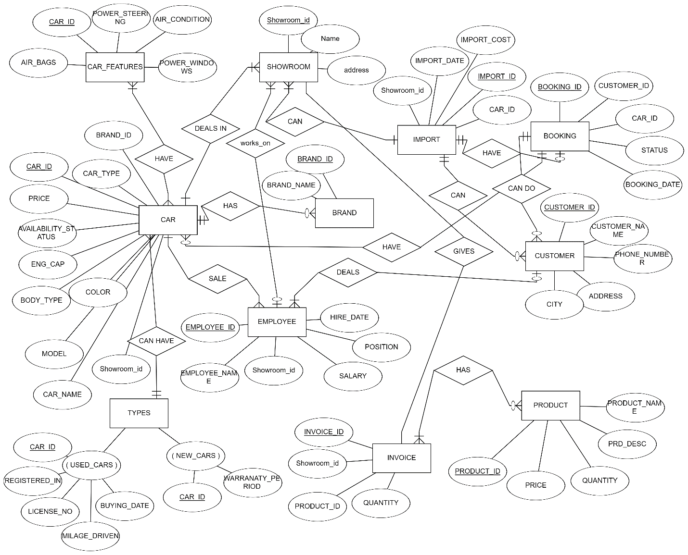

# CarSaaz - Entity Relationship Diagram

This document describes the logical data model of the CarSaaz Management
System, the relationships between its entities, and the design rationale
behind each choice.

---

## 1. Original ERD (January 2024 course submission)

The hand-drawn Chen-notation diagram below was the deliverable that
accompanied the original **Introduction to Database Systems** project.
It captures the schema as first conceived:



Entities in the original design:

* Core: `CAR`, `CAR_FEATURES`, `SHOWROOM`, `BRAND`, `CUSTOMER`,
  `EMPLOYEE`, `BOOKING`
* Specialisations: `USED_CARS`, `NEW_CARS`
* Peripheral: `IMPORT`, `PRODUCT`, `INVOICE`

### What changed in the refined version

During the portfolio rework, the following structural issues were
fixed without altering the conceptual model:

| # | Original                                                    | Refined                                                         | Why                                                    |
|---|-------------------------------------------------------------|-----------------------------------------------------------------|--------------------------------------------------------|
| 1 | `INVOICE` held both booking billing and product-sale lines  | Split into `INVOICE` (1-to-1 with `booking`) + `PRODUCT_SALE`   | Different lifecycles, different FK obligations         |
| 2 | Prices stored as `VARCHAR`                                  | `DECIMAL(12,2)` everywhere                                      | Enables `SUM`, `AVG`, `ORDER BY`                       |
| 3 | Statuses as free-text                                       | `ENUM` for `car_type`, `status`, `payment_method`, etc.         | Rejects invalid values at insert, no lookup join       |
| 4 | `IMPORT` and `PRODUCT` named loosely                        | Renamed `CAR_IMPORT` and `CAR_PRODUCT`                          | Scopes the namespace; avoids collisions                |
| 5 | No `UNIQUE` on `customer.phone` / `customer.email`          | Both declared `UNIQUE`                                          | Prevents duplicate customers                           |
| 6 | Foreign-key actions left to default                         | Explicit `ON DELETE RESTRICT / CASCADE / SET NULL` per relation | Protects financial history; cleans up sub-types        |
| 7 | No indexes beyond primary keys                              | 17 non-primary indexes on JOIN / WHERE / ORDER BY columns       | Keeps query latency flat as data grows                 |

The refined version is modelled in Mermaid below - it is the exact
schema implemented in [`sql/01_schema.sql`](../sql/01_schema.sql).

---

## 2. Refined ERD (portfolio rework)

The diagram below is rendered natively by GitHub (Mermaid):

```mermaid
erDiagram
    BRAND ||--o{ CAR : "offers"
    SHOWROOM ||--o{ CAR : "stocks"
    SHOWROOM ||--o{ EMPLOYEE : "employs"
    SHOWROOM ||--o{ PRODUCT_SALE : "fulfils"
    SHOWROOM ||--o{ CAR_IMPORT : "receives"

    CAR ||--o| NEW_CAR : "is-a (new)"
    CAR ||--o| USED_CAR : "is-a (used)"
    CAR ||--o| CAR_FEATURES : "has features"
    CAR ||--o| CAR_IMPORT : "imported as"
    CAR ||--o{ BOOKING : "is booked in"

    CUSTOMER ||--o{ BOOKING : "makes"
    CUSTOMER ||--o{ PRODUCT_SALE : "purchases"

    EMPLOYEE ||--o{ BOOKING : "handles"

    BOOKING ||--|| INVOICE : "generates"

    CAR_PRODUCT ||--o{ PRODUCT_SALE : "sold as"

    BRAND {
        int brand_id PK
        varchar brand_name UK
        varchar country
    }

    SHOWROOM {
        int showroom_id PK
        varchar name UK
        varchar address
        varchar city
        varchar phone
    }

    CAR {
        int car_id PK
        int brand_id FK
        int showroom_id FK
        varchar model_name
        varchar color
        smallint model_year
        varchar body_type
        int engine_cc
        enum fuel_type
        enum car_type
        decimal price
        enum availability_status
        timestamp created_at
    }

    NEW_CAR {
        int car_id PK_FK
        int warranty_months
        int free_service_count
    }

    USED_CAR {
        int car_id PK_FK
        varchar registered_city
        varchar license_no UK
        int mileage_km
        int previous_owners
        date registration_date
    }

    CAR_FEATURES {
        int car_id PK_FK
        int air_bags
        bool power_steering
        bool air_condition
        bool power_windows
        bool sunroof
        bool gps
    }

    CUSTOMER {
        int customer_id PK
        varchar name
        varchar phone UK
        varchar email UK
        varchar address
        varchar city
        timestamp created_at
    }

    EMPLOYEE {
        int employee_id PK
        int showroom_id FK
        varchar name
        varchar phone
        enum position
        decimal salary
        date hire_date
    }

    BOOKING {
        int booking_id PK
        int customer_id FK
        int car_id FK
        int employee_id FK
        date booking_date
        enum status
        varchar notes
        timestamp created_at
    }

    INVOICE {
        int invoice_id PK
        int booking_id FK_UK
        decimal total_amount
        decimal tax_amount
        enum payment_method
        enum payment_status
        date invoice_date
    }

    CAR_PRODUCT {
        int product_id PK
        varchar product_name UK
        enum category
        decimal price
        int stock_quantity
        varchar description
    }

    PRODUCT_SALE {
        int sale_id PK
        int product_id FK
        int customer_id FK
        int showroom_id FK
        int quantity
        decimal unit_price
        date sale_date
    }

    CAR_IMPORT {
        int import_id PK
        int car_id FK_UK
        int showroom_id FK
        decimal import_cost
        date import_date
        varchar origin_country
    }
```

---

## 3. Relationship Summary

| # | Parent         | Child          | Cardinality | Meaning                                           |
|---|----------------|----------------|-------------|---------------------------------------------------|
| 1 | `brand`        | `car`          | 1 : N       | A brand produces many cars                        |
| 2 | `showroom`     | `car`          | 1 : N       | A showroom stocks many cars                       |
| 3 | `showroom`     | `employee`     | 1 : N       | Employees belong to one showroom                  |
| 4 | `showroom`     | `product_sale` | 1 : N       | Sales are recorded at a showroom                  |
| 5 | `showroom`     | `car_import`   | 1 : N       | Imports arrive at a specific showroom             |
| 6 | `car`          | `new_car`      | 1 : 0..1    | ISA - only if `car_type = 'new'`                  |
| 7 | `car`          | `used_car`     | 1 : 0..1    | ISA - only if `car_type = 'used'`                 |
| 8 | `car`          | `car_features` | 1 : 0..1    | Each car has at most one feature set              |
| 9 | `car`          | `car_import`   | 1 : 0..1    | Imported cars have one import record              |
|10 | `car`          | `booking`      | 1 : N       | A car can be booked multiple times over its life  |
|11 | `customer`     | `booking`      | 1 : N       | A customer can place many bookings                |
|12 | `customer`     | `product_sale` | 1 : N       | A customer can buy many accessories               |
|13 | `employee`     | `booking`      | 1 : N       | A salesperson handles many bookings               |
|14 | `booking`      | `invoice`      | 1 : 1       | Every confirmed booking yields one invoice        |
|15 | `car_product`  | `product_sale` | 1 : N       | A product can appear in many sales                |

The `CAR -> NEW_CAR` and `CAR -> USED_CAR` relationships implement an
**ISA (inheritance) hierarchy**: the super-type `CAR` stores attributes
common to every vehicle, while the two sub-types store attributes that
are meaningful only for that specialisation. Business logic guarantees
that a `CAR` row appears in exactly one sub-type table based on its
`car_type` column.

---

## 4. Design Rationale

### 4.1 Why the schema is shaped this way

* **One table per real-world entity** avoids the "god table" anti-pattern
  and keeps each table narrow and purposeful.
* **Surrogate integer keys** (`*_id`) instead of natural keys such as
  phone number or license plate, because natural keys can change (phones
  are reassigned, plates are transferred) while IDs never do.
* **Reference tables** (`brand`, `showroom`) store repeating values once;
  updating `Toyota` to `Toyota Motor Co.` is a single-row change.
* **ENUM columns** for short, closed vocabularies (`status`, `car_type`,
  `payment_method`) enforce valid values at the database layer without
  a separate lookup table.
* **Strong typing for money** (`DECIMAL(12,2)`) preserves precision; the
  original schema stored prices as `VARCHAR` which would fail arithmetic
  queries and sorting.
* **Dates as `DATE`** (not strings) enable range queries and
  `DATE_FORMAT`-based aggregations (see Q11, Q16).

### 4.2 How normalisation improves the system

| Form | Guarantee                                    | Example in CarSaaz                              |
|------|----------------------------------------------|-------------------------------------------------|
| 1NF  | Atomic values, no repeating groups           | `customer.phone` is a single value, not a list  |
| 2NF  | No partial dependency on composite keys      | No composite keys exist; trivially satisfied    |
| 3NF  | No transitive dependency on non-key columns  | `brand_name` lives in `brand`, not in `car`     |

Because `brand_name` depends on `brand_id` (not on `car_id`), moving it
into its own `brand` table eliminates the transitive dependency and
prevents update anomalies - exactly what 3NF promises.

### 4.3 Indexing strategy

Indexes were added on columns that feature in `WHERE`, `JOIN`, and
`ORDER BY` clauses of the demo queries:

* `car(availability_status, car_type, brand_id, showroom_id, price)`
* `booking(customer_id, car_id, booking_date, status)`
* `invoice(payment_status, invoice_date)`
* `car_product(category, stock_quantity)`
* `product_sale(product_id, customer_id, sale_date)`

Primary keys and `UNIQUE` constraints contribute implicit indexes on
`customer.phone`, `customer.email`, `used_car.license_no`, and more.

### 4.4 Referential actions

* `ON DELETE CASCADE` for sub-type tables (`new_car`, `used_car`,
  `car_features`, `car_import`): deleting a car removes its dependent
  rows automatically.
* `ON DELETE RESTRICT` for customer / car from bookings and invoices:
  business records cannot be orphaned.
* `ON DELETE SET NULL` for `booking.employee_id`: if a salesperson
  leaves, their historical bookings remain but become unassigned.

---

## 5. Candidate Alternatives Considered

* **Single flat `car` table with nullable new-car / used-car columns** -
  rejected because it allows nonsensical states (a "new" car with a
  mileage) and produces lots of `NULL`s.
* **Storing `features` as a comma-separated list inside `car`** -
  rejected because it violates 1NF and defeats indexing.
* **Using `TEXT` for `status`** - rejected in favour of `ENUM`, which
  documents valid values and saves storage.

This ER design is therefore both **normalised** and **pragmatic**,
striking a balance between theoretical purity and the quick-access
needs of an operational dealership platform.
